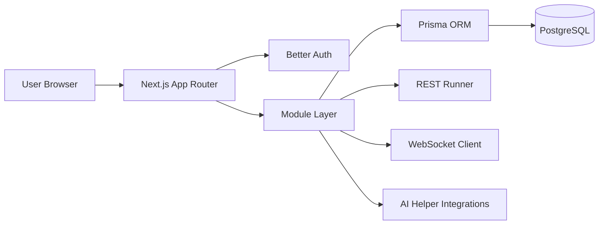
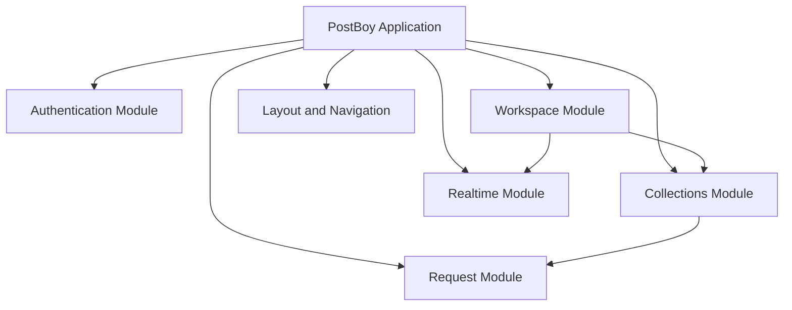
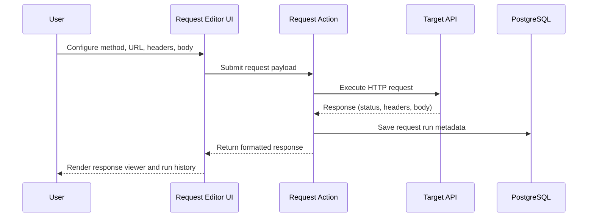
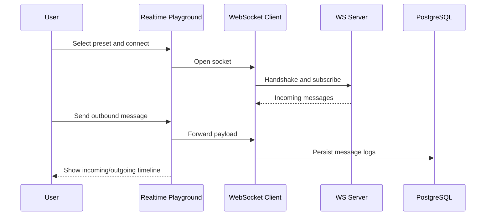

# PostBoy

PostBoy is a modern API collaboration platform inspired by Postman.  
It combines REST request workflows, realtime WebSocket testing, workspace-based organization, and authentication into a single Next.js application.

## Why PostBoy

PostBoy helps teams design, test, and manage APIs from one place:

- Build and run REST requests with params, headers, and body editors
- Organize endpoints using workspace-scoped collections
- Track responses and request run history
- Test realtime systems with WebSocket presets and message logs
- Collaborate inside shared workspaces with role-based membership

## Architecture Overview

### High-Level System Diagram



### Application Modules



## Core Flows

### 1) REST Request Execution Flow



### 2) WebSocket Realtime Flow



## Tech Stack

- **Framework:** Next.js 15 (App Router), React 19, TypeScript
- **Database:** PostgreSQL with Prisma ORM
- **Auth:** Better Auth (social providers + session management)
- **State/Data:** TanStack React Query and Zustand
- **UI:** Tailwind CSS + Radix UI components
- **AI Integrations:** Google and OpenAI SDKs

## Getting Started

### 1) Clone and install dependencies

```bash
git clone https://github.com/Akshatkant101/PostBoy.git
cd PostBoy
npm install
```

### 2) Create environment variables

Create a `.env` file in the project root:

```env
DATABASE_URL=
BETTER_AUTH_SECRET=
BETTER_AUTH_URL=http://localhost:3000

GITHUB_CLIENT_ID=
GITHUB_CLIENT_SECRET=

GOOGLE_CLIENT_ID=
GOOGLE_CLIENT_SECRET=

NEXT_PUBLIC_APP_URL=http://localhost:3000

GOOGLE_GENERATIVE_AI_API_KEY=
```

### 3) Start local services

`npm run dev` starts PostgreSQL via Docker Compose and launches the Next.js dev server.

```bash
npm run dev
```

Default database settings from `docker-compose.yml`:

- User: `postgres`
- Password: `postgres`
- Database: `postgres`
- Host port: `5433`

### 4) Apply Prisma migrations

```bash
npx prisma migrate deploy
```

For iterative local development:

```bash
npx prisma migrate dev
```

## Available Scripts

- `npm run dev` - Start local database and development server
- `npm run build` - Build for production
- `npm run start` - Start production server
- `npm run lint` - Run ESLint checks

## Repository Structure

- `src/app` - App Router pages, layouts, and route groups
- `src/modules` - Domain modules (`authentication`, `workspace`, `collections`, `request`, `realtime`)
- `src/components` - Shared UI and provider components
- `src/lib` - Core utilities (`auth`, `db`, `env`, helpers)
- `prisma` - Schema definition and migration history

## Operational Notes

- Ensure Docker Desktop is running before `npm run dev`.
- Configure OAuth callback URLs to match `BETTER_AUTH_URL` and `NEXT_PUBLIC_APP_URL`.

